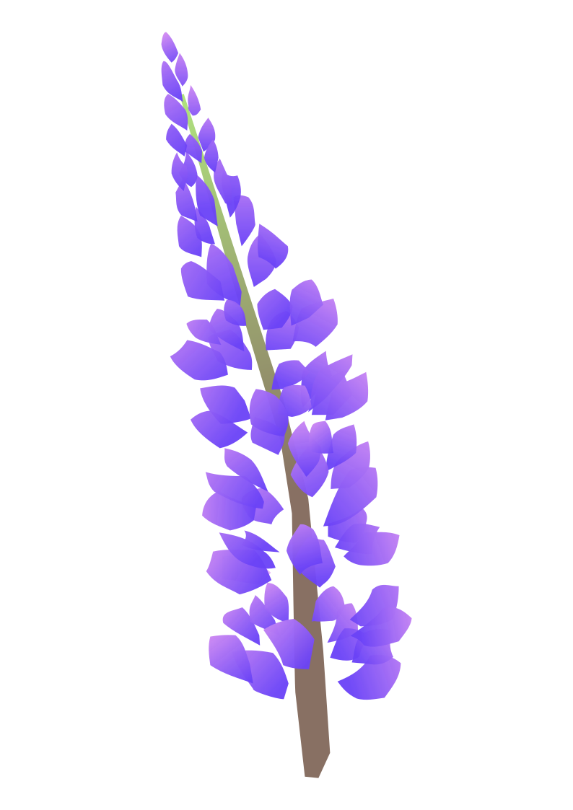

# Roosa & Janne

<h2 class="subtitle">30.8.2025 klo 14.00 - Kallion kirkko</h2>

## RSVP

Tästä voit vastata hääkutsuun omalla nimelläsi. Järjestelmä ilmoittaa sinulle, kuinka monelle ja keille kaikille henkilöille kutsu on. Vastaamisen yhteydessä voit jättää ruokavaliotietosi, jotta voimme ottaa ne huomioon. Vastausta on mahdollista muuttaa 14.8.2025 saakka. Mikäli kutsutiedoissasi on jotain häikkää, ole yhteydessä.

## Vihkiminen

### Kallion kirkko

Kallion kirkko on vuonna 1912 valmistunut kivikirkko. Tämän 65 metriä korkean kellotornin alla sanomme (toivottavasti) toisillemme _tahdon_ ensi vuoden elokuussa. Vihkikirkkoon voit tutustua tarkemmin [Helsingin seurakuntien sivuilla](https://www.helsinginseurakunnat.fi/kallionkirkko/artikkelit/k2hvhc5hl).

### Vihkimisestä

Juridisesti menidät tuomittiin aviopuolisoiksi jo 1.5., mutta Suomen evankelisluterilainen kirkko on ystävällisesti suostunut siunaamaan avioliittomme. Toimituksen ei pitäisi juurikaan erota tutusta vihkikaavasta, mutta tarkkasilmäinen teologi voi ehkä jokusen poikkeavan sanamuodon havaita.

Tilaisuus noudattaa jotakuinkin [avioliiton siunaamisen kaavaa](https://kirkkokasikirja.fi/toim/04c_aviol_siun.pdf) ja se kestää noin 30 minuuttia.

Vihkimisen jälkeen häävieraat voivat kirkon kuvauksellisilla portailla heittää eläviä matoja hääparin päälle :shrug:

## Hääjuhla

### Soutupaviljonki

[Soutupaviljonki](https://soutupaviljonki.fi/) on alunperin Helsingin olympialaisia varten rakennettu kaunis ja historiallinen puutalo aivan Helsingin keskustan kupeessa, kauniilla merenrantapaikalla.

### Ohjelma / aikataulu

| klo   | asia 
| ----- | ----------
| 14.00 | Vihkiminen 
| 15.00 | Hääjuhla alkaa
|       | Alkuruoka 
|       | Pääruoka 
|       | Jälkiruoka 
|       | Hääkimppu lentää 
|       | Sips & Dips 
| 01.30 | Hyvää yötä, Jeesus myötä 

### Ruoka ja juoma

Tarjoamme tilaisuudessa ruokaa ja juomaa. Ilmoittatumisen yhteydessä annetut ruokavaliotiedot otetaan huomioon tarjoiluissa. Jos tulee kova nälkä, Soutupaviljongille on varmastikin mahdollista tilata pizzaa jos siltä tuntuu.

### Valokuvaus

Mukanamme on koko päivän valokuvaaja. Hän ottaa ns. virallisia kuvia meistä, päivän tärkeistä hetkistä ja toki myös potretteja hääparin kanssa. Jaamme kuvat myös vieraiden kanssa. Kannustamme teitä ottamaan itse varsinkin ns. fiiliskuvia, jotka voi ladata [jaettuun Google-drive kansioon](https://www.google.com/url?sa=t&source=web&rct=j&opi=89978449&url=https://www.youtube.com/watch%3Fv%3DdQw4w9WgXcQ&ved=2ahUKEwiz07XbirmIAxWvLBAIHUqNBBgQwqsBegQIDxAG&usg=AOvVaw0aHtehaphMhOCAkCydRLZU) kaikkien nähtäviksi.

### Dresscode

Tilaisuuteen on suotava saapua vaatteet päällä. Loppuillasta arvioimme vaatetuksen tarvetta tapauskohtaisesti.

### Puheet

Mikäli tahdot pitää lyhyen morsianta maasta taivaisiin ylistävän puheen, ole yhteydessä Ella Saranpää-Hakokönkääseen. Hän kertoo pääsetkö puhumaan.

### Jatkot

Noin kello 21. aloitamme mm. tanssia ja laulua sisältävät jatkot. Tähän asti lapset ovat jopa toivottuja osallistujia, mutta jatkojen aikana heidän olisi suotavaa siirtyä johonkin muualle. Suosittelemme kotibileitä, sillä vanhemmat ovat häissämme.

## Saapuminen

Julkisilla: reitit ja kartat
Autolla: pysäköinti + liityntäpysäköinti

## Häälahja

Pls. give us money so we can go to Italy yes?

## FAQ

### Saanko tuoda eilisen tindermatchini paikalle?

Noo mitä jos vaikka et toisi?

### Keiltä kysyä lisätietoa

Lisätietoa voipi kysellä Jannelta
